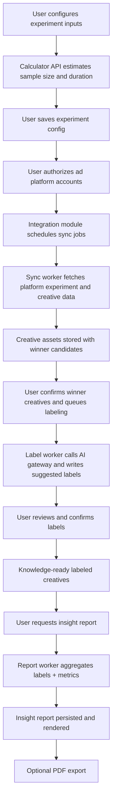

# Data Flow

## End-to-End Flow

## Async Pipeline States

- Sync jobs: `queued -> running -> success | partial_failed | failed`
- Label tasks: `queued -> running -> awaiting_review -> completed | failed`
- Insight reports: `queued -> running -> ready | failed`

## Reliability Controls by Flow Stage

- External sync and AI calls: timeout + exponential backoff retry for retryable errors only.
- Idempotent write actions: create job, batch label confirm, report generation, export.
- Failure visibility: explicit error codes and messages attached to async task records.
- Recovery model: users can re-trigger failed stages without duplicating successful work.
