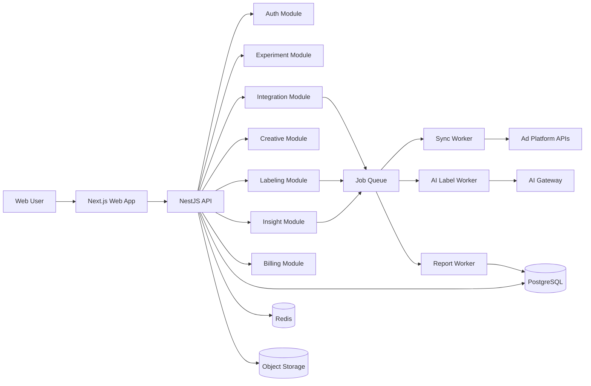

# Architecture Overview

CreativeInsight MVP follows a **modular monolith + async workers** model to balance speed of delivery and future scale.
The system focuses on three value chains: experiment design, cross-platform winning creative management, and AI labeling with insight reports.

## System Topology

## Core Principles

- Monolith first, but enforce strict module boundaries.
- Strong consistency on write paths; optional cached/pre-aggregated read paths.
- Treat all third-party dependencies as unreliable: timeout, retry, circuit-break, degrade.
- Define idempotency and concurrency contracts before business implementation.

## Tech Stack Snapshot

- Frontend: Next.js, TypeScript, Tailwind, shadcn/ui
- Backend: NestJS, REST + OpenAPI, PostgreSQL, Redis, BullMQ
- AI/media: AI gateway, ASR provider, FFmpeg worker, schema-validated labeling output
- Observability: OpenTelemetry, Loki, Prometheus/Grafana, Sentry
